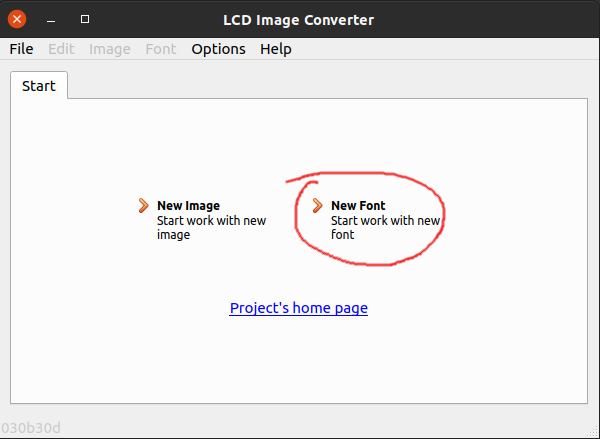
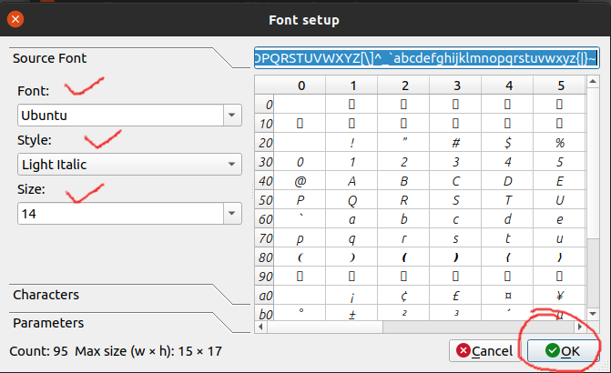
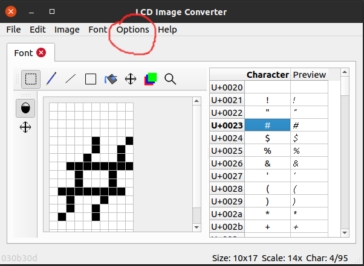
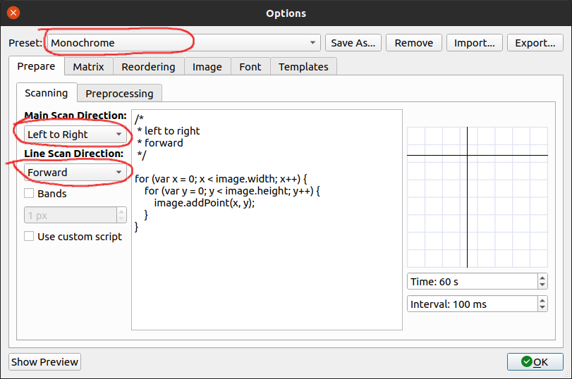
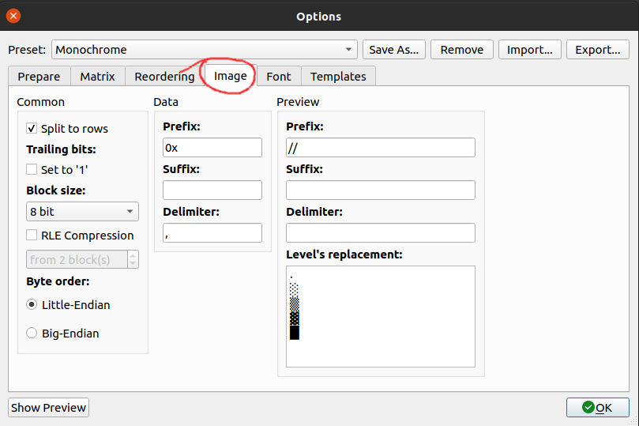
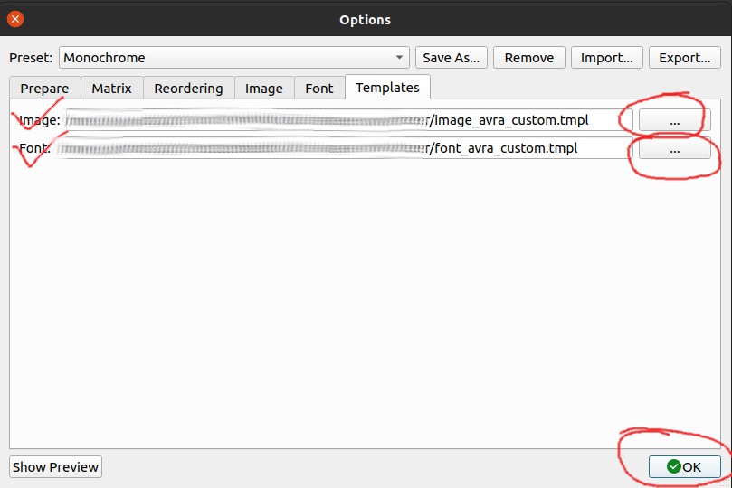

## About:
This repository is a tutorial about how to create fonts (and bitmap images) for embedded system displays to use with my display drivers. It also has some font files prepared following this tutorial. I use this method for all my display driver codes. 

Here, I'm using [riuson](https://github.com/riuson)'s "**lcd-image-converter**" software and it's added as a submodule with this repository. This software makes making fonts and image bitmaps really easy. Also, it is highly customizable, so you can tweak your rendering algorithm as per your choice.

A detailed documentation is avaialable in his [website](https://lcd-image-converter.riuson.com/en/about/). I highly recommend it to go and read that documentation. He also provided rendering algorithm there.

**Note: I've modified the template files which are used to format the ouput .h/.c code, and also modified the "bitmap_typedefs.h" slightly. The later one has all the required definitions of custom datatypes used by the font files.**

Now, I'm going to explain how to use this software to create fonts that are suitable for my display driver codes (listed below):

- [ILI9341 - STM32F1 8-Bit Parallel Display Driver](https://github.com/abhra0897/stm32f1_ili9341_parallel.git)
- [ST7789 - STM32F1 SPI Display Driver](https://github.com/abhra0897/stm32f1_st7789_spi.git)

## Instructions (Create Fonts):

### 1. Download or Compile the Software
Go to Riuson's [website](https://lcd-image-converter.riuson.com/en/about/) or [GitHub repo](https://github.com/riuson/lcd-image-converter.git) and download/compile from source code by following the instructions given there. Run the software.

### 2. Select Type
After you run the application, it'll ask you to select either "**New Image**" or "**New Font**". Select "**New Font**".
. Give the font a name. I highly recommend giving a meaningful name like "*font_ubunu_mono_bold_16*".

### 3. Select Font
Select which font you want to use in your embedded application. Then select its style and size. Then click "**Ok**".

If you're using a monospace font, I'd recommend you to go to the "**Parameters**" option and check the "Monospace" radio-button. It's not mandatory though. 

### 4. Click "Options"
In this window, you can see each character. If you want, you can modify the glyphs by drawing over them. Click on the "**Options**" tab.

### 5. Click "Conversion"
After selecting option, select "**Conversion**"

### 6. Prepare
In "**Prepare**" tab, configure the settings as per the given image:

### 7. Image
Go to the "**Image**" tab and configure the output settings as per the image below:

### 8. Template
This is the last step of configuration. Click on the "**Template**" tab and select the proper template files which are found in this repository.
- [Font template](templates/font_avra_custom.tmpl)
- [Image template](templates/image_avra_custom.tmpl)

Click the "**OK**" button ans "**Save Changes**".

### 9. Convert All
Configuration is done. Now Go to "**File**" and click "**Convert All**". Save the output file in "**C/C++ Header**" format. 

### 10. rename File
After the file is saved, you can see it's saved as *your_file_name* **.c**. We need it to be in **.h** format. So, reame the file to *your_file_name* **.h**.

### 11. Done! Now use it
Now you've successfully created a font, include the generated header file in your code along with the [bitmap_typedefs.h](fonts/bitmap_typedefs.h) file.

### [To learn how to use the fonts, check the example codes given in my display driver repos.]

### License
**lcd-image-converter** has its own licensing information.

All other source codes and files of the root directory are licensed under MIT License, unless the source file has no other license asigned for it. See [MIT License](LICENSE).